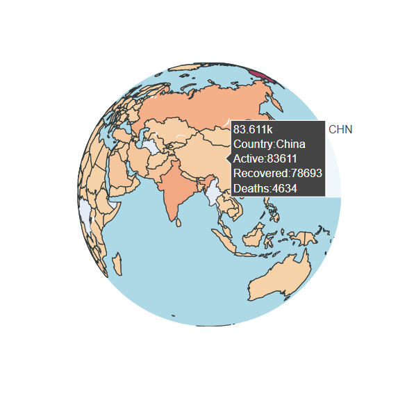
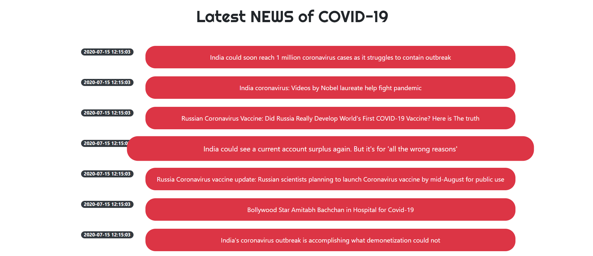
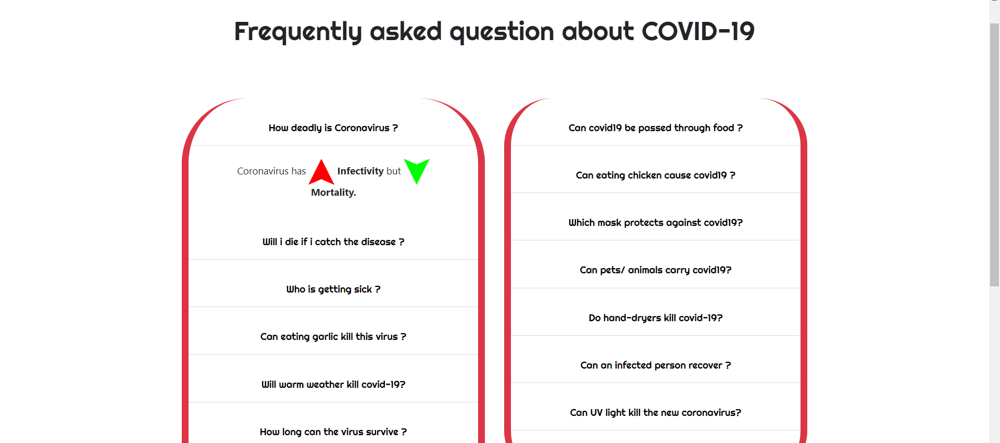
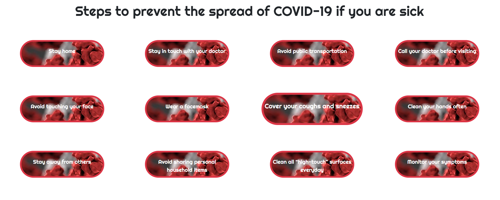
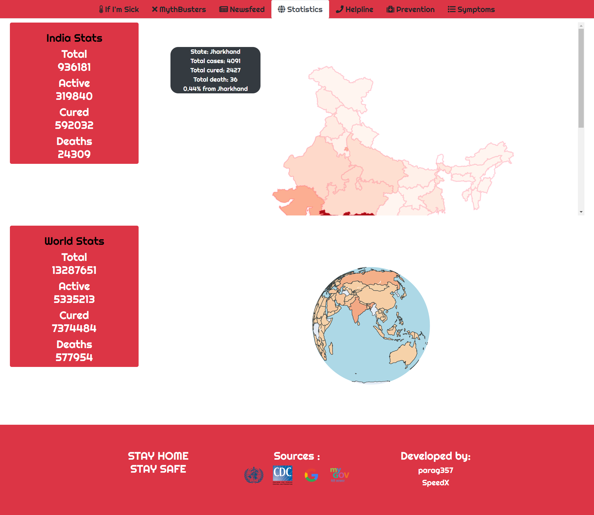
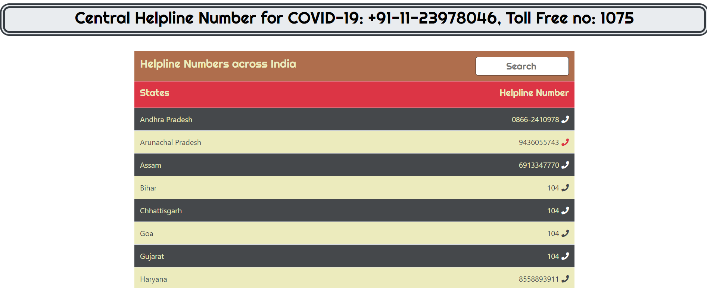
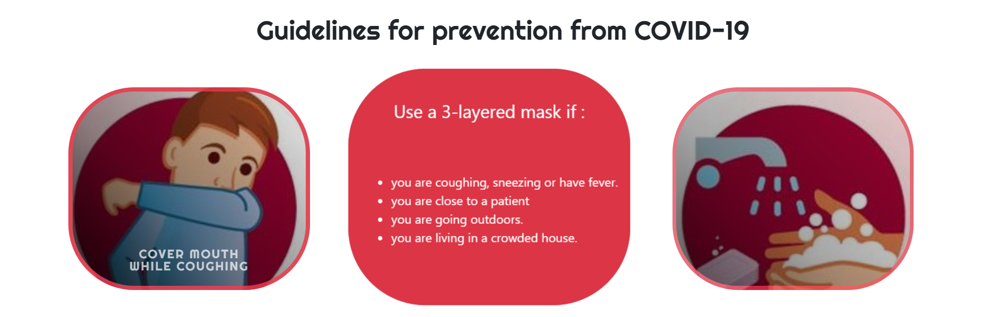
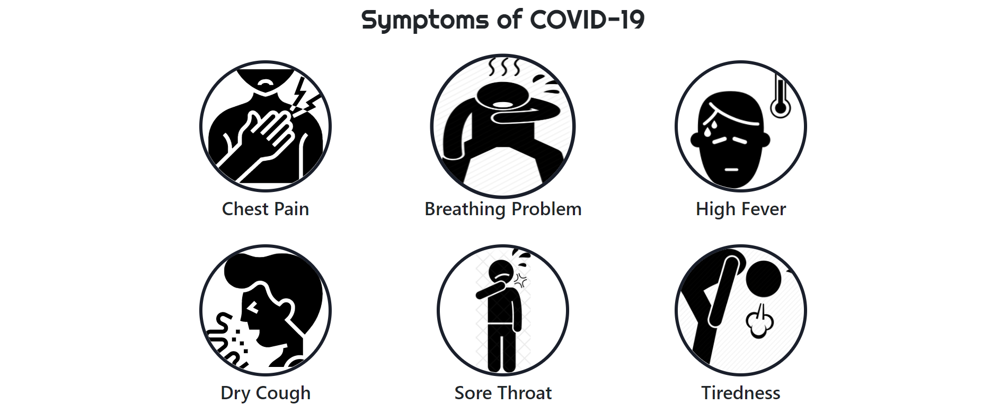
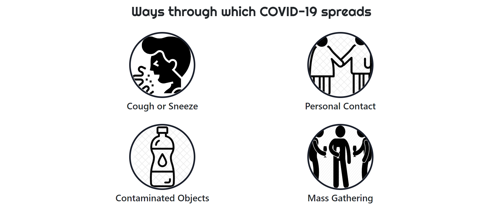

# A responsive and interactive web application to arouse awareness about THE NOVEL CORONAVIRUS PANDEMIC.

this website contains statistics, interactive visualisations, latest news, helplines and other necessary information regarding the current pandemic situation.

Visit [covid-in.herokuapp.com](http://covid-in.herokuapp.com/) or click on the icon below:

# Screenshots

interactive world map visualisation

latest news

some common mythbusters

steps to follow if someone is sick

latest statistics and visualisations

helpline numbers across India

preventive measures to follow

symptoms of infected person

ways through which this virus spreads

